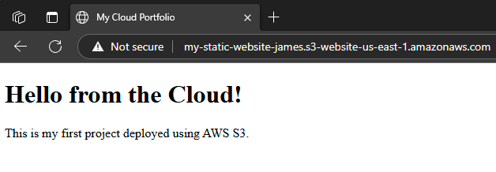

# Deploy a Static Website on AWS S3 (Free Tier Friendly)

This guide walks you through hosting a static HTML/CSS website using **Amazon S3**, using only the AWS Free Tier.

---

## Prerequisites

- AWS Free Tier Account  
- [AWS CLI](https://docs.aws.amazon.com/cli/latest/userguide/install-cliv2.html) (optional but helpful)  

---

## Step-by-Step Instructions

### Step 1: Log in to the AWS Management Console

Go to: [AWS Console](https://console.aws.amazon.com)  
Log in using your **root user** or **IAM user** credentials (recommended).

---

### Step 2: Create an S3 Bucket

1. Go to **S3** service.
2. Click **"Create bucket"**.
3. Enter a **unique bucket name** (e.g., `my-static-website-bucket`).
4. Choose **Region** (stick to default or the nearest one).
5. **Uncheck "Block all public access"** under *Object Ownership*.
6. Acknowledge the warning and click **Create bucket**.

---

### Step 3: Create an index.hmtl file

1. Open a notepad
2. Copy the HTML Script below
    ```html
     <!DOCTYPE html>
     <html>
      <head>
        <title>My Cloud Portfolio</title>
      </head>
      <body>
        <h1>Hello from the Cloud!</h1>
        <p>This is my first project deployed using AWS S3.</p>
      </body>
    </html>
    ```

3. Save the file as **index.html**

---

### Step 4: Upload Website Files

1. Click on your newly created bucket.
2. Click **"Upload"** > **"Add files"**.
3. Upload your `index.html`, `styles.css`, etc.
4. Click **"Upload"** to finish.

---

### Step 5: Enable Static Website Hosting

1. In the bucket, go to **Properties** tab.
2. Scroll to **"Static website hosting"** and click **Edit**.
3. Choose:  
   - **Enable**  
   - Index document: `index.html`  
   - (Optional) Error document: `error.html`
4. Click **Save changes**.
5. Copy the **endpoint URL** shown — this is your public website link!

---

### Step 6: Make Files Public

1. Go to the **Permissions** tab of your bucket.
2. Scroll down to **Bucket policy**, click **Edit**.
3. Paste this policy (replace `your-bucket-name`):

```json
{
  "Version": "2012-10-17",
  "Statement": [
    {
      "Sid": "PublicReadGetObject",
      "Effect": "Allow",
      "Principal": "*",
      "Action": "s3:GetObject",
      "Resource": "arn:aws:s3:::your-bucket-name/*"
    }
  ]
}
```
---
### Step 7: Test Your Website

1. Go back to Static Website section.
2. Copy the Website endpoint URL
3. Paste it in your favorite browser

---

NOTE: You should get a similar output to the screenshot below


